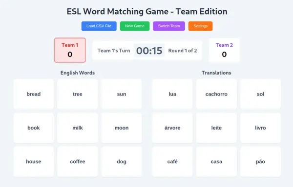

# Card Match

> An ESL classroom vocabulary matching game

## How to play

Match the English cards with the translations or definitions in the native language.
The game ends when all rounds are completed.
The number of rounds is configurable.

The default words are English and Portuguese.
Upload your own words in `English,Translation` CSV format (no need to include the header).

This game comes with both a team mode and a practice mode!
In team mode, players match as many word pairs as they can within the time limit.
After the time limit is reached, teams switch.
If you have a blackboard or something else to write on, you can also use practice mode and keep score manually.

## Disclaimers

a) This game works best on a large touch screen or smart screen, if your classroom has one.
   This way, students can interact with the cards directly rather than using a mouse.
a) Bugs likely exist. Report them on the [issues page](https://github.com/thinlines/card-match/issues).
b) Points earned are only redeemaable for eternal glory. No cash value.

## Contact and support

If you find any issues, open an issue on [this project's issues page](https://github.com/thinlines/card-match/issues).